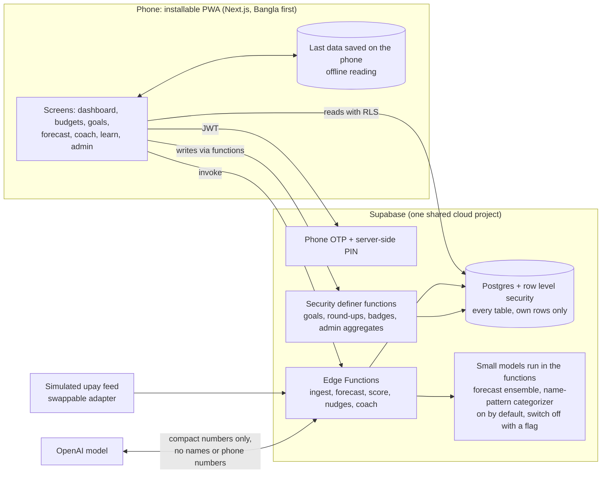

# Architecture (one slide)

## What to say

- **Numbers come from code, never from the AI.** The health score, the 30-day forecast and every affordability verdict are computed by tested code. The model only explains them in Bangla or English.
- **Privacy by design.** Row level security on every table, a PIN checked only on the server, the coach sees a short summary with no phone, name or merchant, and the admin view only shows groups of 5 or more people.
- **Small learned models, on our own server.** The 30-day forecast can use a seasonal model (Holt-Winters plus a trained ridge regression) and shows a likely range; merchant names the keyword rules cannot place can be filed by a pattern model. They run inside our functions, so no customer data goes to a third party for them, and each one falls back to the plain rules if it declines or fails. On simulated people the forecast model cut balance error by about 30%; see `docs/ML_REPORT.md` for what that does and does not show.
- **Swappable data source.** The simulated upay feed implements the same interface a real upay API would, so the rest of the app does not change.
- **Works offline.** After one visit the app opens without a connection and shows the last saved data; changes wait until the phone is back online.
